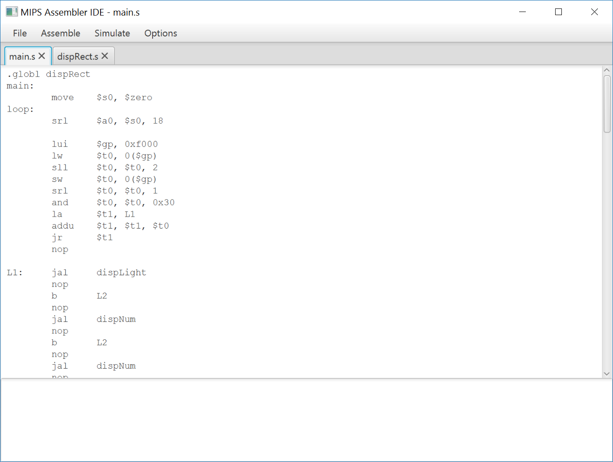
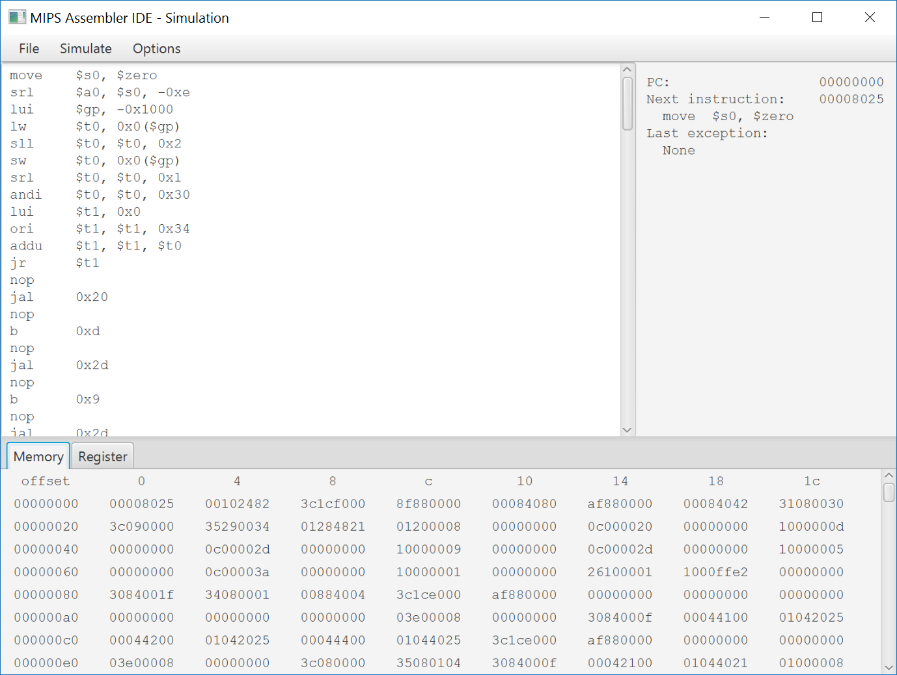

#MIPS Assembler IDE

This is my project for the course Computer Organization, Zhejiang University.

The assembler, disassembler and simulator is based on "MIPS32 Architecture for Programmers Volume II: The MIPS32 Instruction Set".

The graphical user interface is powered by javaFX.

##Assembler

The assembler is capable of assembling multiple source files and generate one binary file. No object files are generated during assembly.

Supported instructions and macro instructions are listed in appendix A.

Supports the following assembler directives:

* .asciiz
* .globl
* .byte
* .half
* .word
* .space

Error checking is performed during assembly, including operand type/count mismatch, label not declared/redeclared, etc. Warnings are signaled for immediate overflow, deprecated operand type, etc.

For instructions that has both a register version and an immediate version(like add and addi), you can always write the shorter mnemonic. The assembler will determine which type of instruction to assemble according to operand types.

Output type is determined by the extension of output file. Available output types include .COE file, hexadecimal text file, and binary file. When writing hexadecimal or binary file, endianness is default to be little, unless specified with -b or -l options in CLI or via the menu in GUI.

##Disassembler

The disassembler can disassemble all three file types output by assembler. When disassembling binary or hexadecimal file, endianness should be correctly configured, otherwise the output will be incorrect with many unrecognized instruction.

Label is currently unsupported in disassembly, so an immediate will be placed in a branch/jump instruction.

##Simulator

Capable of loading all three file types output by assembler. When loading binary or hexadecimal file, endianness should be correctly configured.

The simulator has a 4GiB memory space that can be directly addressed by the MIPS program. Program is loaded into this memory space, starting from address 0, while the initial value of program counter can be configured. Subsequent instructions are fetched from this memory space.

Data in memory and register file can be modified manually before and during a simulation.

Exceptions are not automatically handled by the simulator; they are simply signaled by the simulator.

Most instructions supported by the assembler are supported by the simulator, however some instructions may have no effect(for example, sync).

##Command line interface

Available options are listed below:

```
-h, --help           Display this help and exit.
-g, --gui            Launch graphical user interface.
-i, --input <files>  Specify the input source files.
-o, --output <files> Specify the output file. Output type depends on the extension of the file.
-a, --assemble       Assemble the input source files.(default)
-d, --disassemble    Disassemble the input binary.
-s, --simulate       Launch simulation on the input binary.
-b, --big-endian     Configure the assembler, disassembler, and simulator as big-endian.
-l, --little-endian  Configure the assembler, disassembler, and simulator as little-endian.(default)
```

The simulator is currently unavailable in command line interface, although this option is present. Running under command line with option -s specified will simply print out a prompt and exit.

##Graphical user interface

The GUI provides basic code editing functionality. Assembly or simulation can run on the currently displayed file or all currently opened files. Disassembling a file will open up a new tab displaying the disassembled code.

The code editor provides NO line numbering or syntax highlighting; javaFX native text area does not support this feature. Sorry for the inconvenience, but you can edit the code in an editor you like, and use the Reload menu option to reload the code before assembly.

Simulator is fully functional in GUI, with memory and register editing pane and a disassembly text area. Data in memory and register can be modified by double-clicking on the cell, and the offset column in memory edit pane can also be edited for fast access to an arbitrary memory location. 

Available simulation operation under GUI include Step, which executes a single instruction, and Run, which runs continuously until the program counter goes out of the program section, an exception occur, or manually aborted.

##Screenshots





##Appendix A: Instructions supported by assembler

* add
* addi
* addiu
* addu
* and
* andi
* b
* bal
* beq
* beql
* bgez
* bgezal
* bgezall
* bgezl
* bgtz
* bgtzl
* blez
* blezl
* bltz
* bltzal
* bltzall
* bltzl
* bne
* bnel
* break
* cache
* clo
* clz
* div
* divu
* j
* jal
* jalr
* jr
* la
* lb
* lbu
* lh
* lhu
* li
* ll
* lui
* lw
* lwl
* lwr
* madd
* maddu
* mfhi
* mflo
* move
* movn
* movz
* msub
* msubu
* mthi
* mtlo
* mul
* mult
* multu
* nop
* nor
* not
* or
* ori
* pref
* sb
* sc
* sdbbp
* sh
* sll
* sllv
* slt
* slti
* sltiu
* sltu
* sra
* srav
* srl
* srlv
* ssnop
* sub
* subu
* sw
* swl
* swr
* sync
* syscall
* teq
* teqi
* tge
* tgei
* tgeiu
* tgeu
* tlt
* tlti
* tltiu
* tltu
* tne
* tnei
* xor
* xori