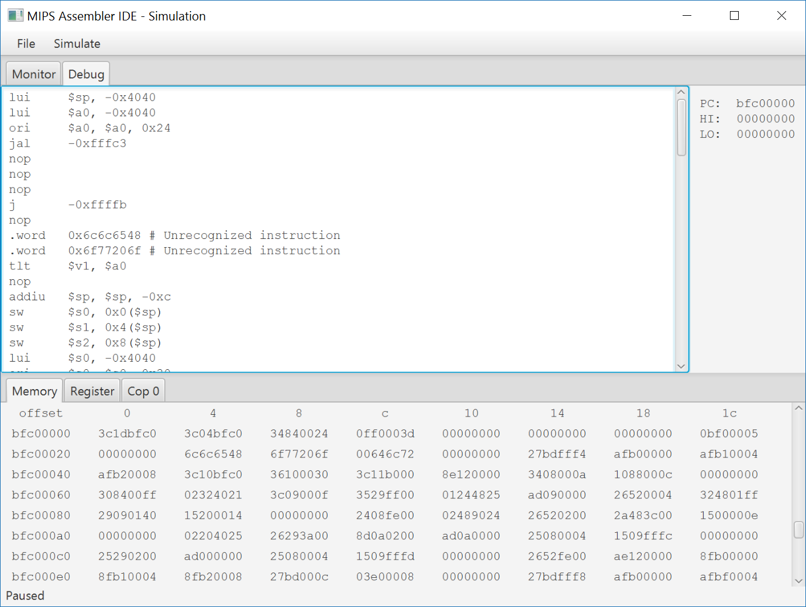
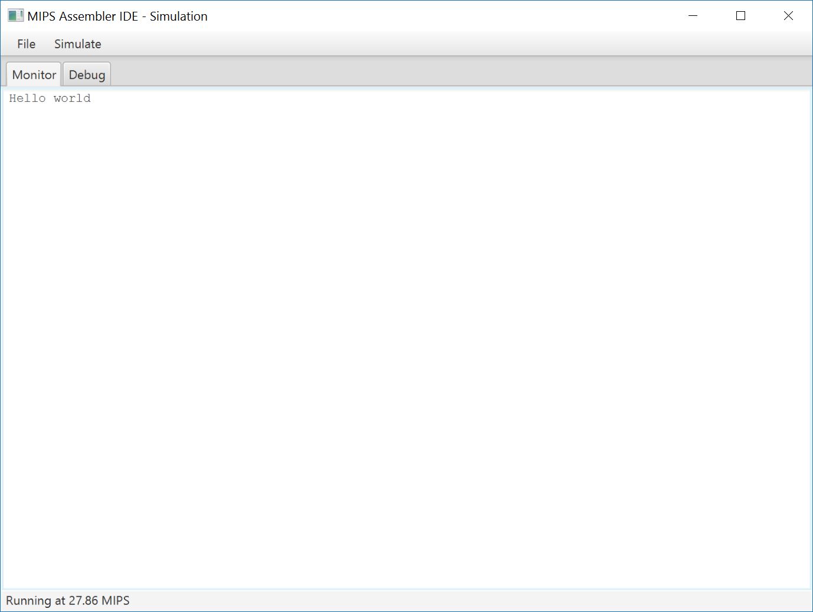

#MIPS Assembler IDE

This is my project for the courses Computer Organization, Computer Architecture, and Operating System.

The assembler, disassembler and simulator are based on *MIPS32 Architecture for Programmers Volume II: The MIPS32 Instruction Set* and *MIPS32 Architecture for Programmers Volume III: The MIPS32 Privileged Resource Architecture*.

The graphical user interface is powered by javaFX.

Executable on Windows platform is packaged by launch4j. Command line interface is unavailable from packaged executable.

##Assembler

The assembler is capable of assembling multiple source files and generating one binary file. No object files are generated during assembly.

Supported instructions and macro instructions are listed in appendix A.

Supports the following assembler directives:

* .asciiz
* .globl
* .byte
* .half
* .word
* .space

Error checking is performed during assembly, including operand type/count mismatch, label not declared/redeclared, etc. Warnings are signaled for immediate overflow, deprecated operand type, etc.

For instructions that has both a register version and an immediate version(like add and addi), the shorter mnemonic is always accepted for either operand types; The assembler will determine which type of instruction to assemble according to operand types.

Output type is determined by the extension of output file. Available output types include .COE file, hexadecimal text file, and binary file. When writing hexadecimal or binary file, endianness is default to be little, unless specified with -b or -l options in CLI or via the menu in GUI.

##Disassembler

The disassembler can disassemble all three file types output by assembler. When disassembling binary or hexadecimal file, endianness should be correctly configured, otherwise the output will be incorrect with many unrecognized instructions.

Label is currently unsupported in disassembly, so an immediate will be placed in a branch/jump instruction.

##Simulator

Capable of loading all three file types output by assembler. When loading binary or hexadecimal file, endianness should be correctly configured.

The simulator features 4GiB physical memory space, coprocessor 0 for privileged instructions, and TLB for address translation. Coprocessor 0 and TLB are written according to 'minimal' requirements from *MIPS32 Architecture for Programmers Volume III*, meaning that anything with compliance labeled as 'Optional' are not implemented in the simulator. However, this should be more than enough for implementing a simple OS.

Before running a simulation, program should be loaded into the memory. The starting address of program can be configured, but should be aligned on word boundary. Program counter points at 0xBFC00000 at the start of a simulation, which is the value after a cold reset.

Most instructions supported by the assembler are supported by the simulator, however some instructions may have no effect(for example, sync).

##Command line interface

Available options are listed below:

```
-h, --help           Display this help and exit.
-g, --gui            Launch graphical user interface.
-i, --input <files>  Specify the input source files.
-o, --output <files> Specify the output file. Output type depends on the extension of the file.
-a, --assemble       Assemble the input source files.(default)
-d, --disassemble    Disassemble the input binary.
-s, --simulate       Launch simulation on the input binary.
-b, --big-endian     Configure the assembler, disassembler, and simulator as big-endian.
-l, --little-endian  Configure the assembler, disassembler, and simulator as little-endian.(default)
```

The simulator is currently unavailable in command line interface, although this option is present. Running under command line with option -s specified will simply print out a prompt and exit.

##Graphical user interface

The GUI provides basic code editing functionality. Assembly or simulation can run on the currently displayed file or all currently opened files. Disassembling a file will open up a new tab displaying the disassembled code.

The code editor provides NO line numbering or syntax highlighting; javaFX native text area does not support this feature. Sorry for the inconvenience, but you can edit the code in an editor you like, and use the Reload menu option to reload the code before assembly. Drag-and-drop is supported for opening a source file.

Simulator is fully functional in GUI, with a monitor tab and a debug tab. The monitor tab acts as an interface between user and the simulator: contents in a specific physical memory page will be displayed in the monitor as ASCII characters, while pressing keys when focused on the monitor will send interrupts to the simulator. The debug pane allows user to monitor almost everything about the simulator, including physical memory, general-purpose registers, and coprocessor 0 registers. Data in memory and general-purpose registers can be modified by double-clicking on the cell, and the offset column in memory tab can also be edited for fast access to an arbitrary memory location.

Available simulation operations under GUI include Step, which executes a single instruction, and Run, which runs the simulator continuously in a background thread. Reset operation can be used anytime to send a cold reset signal to the simulator, including when simulator is running in a background thread.

##Screenshots






##Appendix A: Instructions supported by assembler

* add
* addi
* addiu
* addu
* and
* andi
* b
* bal
* beq
* beql
* bgez
* bgezal
* bgezall
* bgezl
* bgtz
* bgtzl
* blez
* blezl
* bltz
* bltzal
* bltzall
* bltzl
* bne
* bnel
* break
* cache
* clo
* clz
* div
* divu
* eret
* j
* jal
* jalr
* jr
* la
* lb
* lbu
* lh
* lhu
* li
* ll
* lui
* lw
* lwl
* lwr
* madd
* maddu
* mfc0
* mfhi
* mflo
* move
* movn
* movz
* msub
* msubu
* mtc0
* mthi
* mtlo
* mul
* mult
* multu
* nop
* nor
* not
* or
* ori
* pref
* sb
* sc
* sdbbp
* sh
* sll
* sllv
* slt
* slti
* sltiu
* sltu
* sra
* srav
* srl
* srlv
* ssnop
* sub
* subu
* sw
* swl
* swr
* sync
* syscall
* teq
* teqi
* tge
* tgei
* tgeiu
* tgeu
* tlbp
* tlbr
* tlbwi
* tlbwr
* tlt
* tlti
* tltiu
* tltu
* tne
* tnei
* xor
* xori